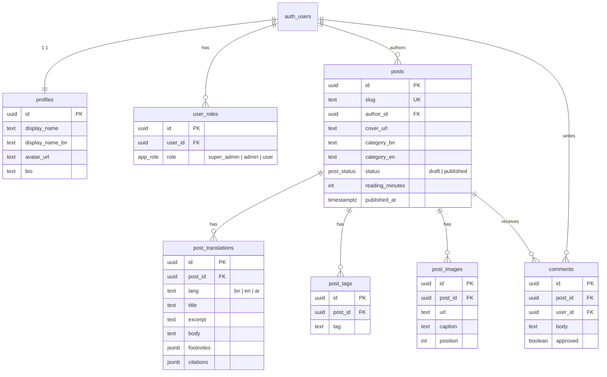

# কিস্তি (KiSti) — Project Walkthrough

> **A multilingual literary blog/journal** in Bengali, English, and Arabic — built with React + Vite + Supabase + TailwindCSS + shadcn/ui.

---

## Tech Stack

| Layer | Technology |
|---|---|
| **Framework** | React 18 + TypeScript |
| **Bundler** | Vite 5 (SWC plugin) |
| **Styling** | TailwindCSS 3 + custom CSS design system |
| **UI Components** | shadcn/ui (49 components in `src/components/ui/`) |
| **Backend / DB** | Supabase (PostgreSQL + Auth + Storage + RLS) |
| **State** | TanStack React Query + local `useState` |
| **Routing** | React Router DOM v6 |
| **Fonts** | Noto Serif Bengali, Hind Siliguri, Cormorant Garamond, Inter, Amiri |
| **Testing** | Vitest + Testing Library |
| **Origin** | Lovable.dev (AI-generated scaffold) |

---

## Project Structure

```
kisti-your-bengali-literary-space-main/
├── index.html                    # Entry HTML (lang="bn", SEO meta, Google Fonts)
├── .env                          # Supabase credentials (project ID, anon key, URL)
├── vite.config.ts                # Vite config (port 8080, SWC, lovable-tagger)
├── tailwind.config.ts            # Extended theme: paper/ink/gold/terracotta tokens
├── package.json                  # Dependencies & scripts
│
├── supabase/
│   └── migrations/
│       ├── ..._185e0dab.sql      # Main schema (profiles, posts, comments, RLS, triggers)
│       └── ..._681ed582.sql      # Follow-up migration
│
└── src/
    ├── main.tsx                  # React root mount
    ├── App.tsx                   # Router + providers (Query, Theme, Tooltip, Toast)
    ├── index.css                 # Design system: CSS variables, font classes, prose styles
    ├── App.css                   # Minimal app-level styles
    │
    ├── data/
    │   └── posts.ts              # Static seed posts (5 sample literary posts, 3 languages)
    │
    ├── hooks/
    │   ├── useAuth.ts            # Auth state + role detection (super_admin/admin/user)
    │   ├── use-mobile.tsx        # Responsive breakpoint hook
    │   └── use-toast.ts          # Toast notification hook
    │
    ├── integrations/supabase/
    │   ├── client.ts             # Supabase client initialization
    │   └── types.ts              # Auto-generated database types (11KB)
    │
    ├── lib/
    │   └── utils.ts              # cn() utility (clsx + tailwind-merge)
    │
    ├── components/
    │   ├── SiteHeader.tsx         # Sticky header: logo, nav (প্রচ্ছদ/প্রবন্ধ/কবিতা/চিন্তা), auth link
    │   ├── SiteFooter.tsx         # 3-column footer: about, sections, colophon
    │   ├── AdminLayout.tsx        # Sidebar admin shell with nav + sign out
    │   ├── RequireAdmin.tsx       # Auth guard for admin routes
    │   ├── Comments.tsx           # Comment list + submit form (moderated)
    │   ├── PostPreview.tsx        # Live editor preview + PNG/Card export
    │   ├── PhotoCardGenerator.tsx # Canvas-based social share card (1080×1350)
    │   ├── PostCard.tsx           # Blog post card component
    │   ├── NavLink.tsx            # Navigation link wrapper
    │   ├── ThemeToggle.tsx        # Light/dark mode toggle
    │   ├── theme-provider.tsx     # next-themes wrapper
    │   └── ui/                   # 49 shadcn/ui primitives
    │
    └── pages/
        ├── Index.tsx              # Homepage: hero + tag filter + featured post + grid
        ├── PostPage.tsx           # Single post: language switcher, body, footnotes, comments
        ├── Auth.tsx               # Sign in / sign up form (first user = super admin)
        ├── NotFound.tsx           # 404 page
        └── admin/
            ├── AdminPosts.tsx     # Post list with status badges, edit/delete
            ├── AdminPostEditor.tsx # Full post editor: multilingual, footnotes, citations, images, live preview
            ├── AdminComments.tsx   # Comment moderation (approve/delete)
            ├── AdminMedia.tsx     # Media library (upload, copy URL, delete)
            └── AdminUsers.tsx     # Role management (super_admin only)
```

---

## Database Schema (Supabase/PostgreSQL)



### Key Security Rules (RLS)
- **Posts**: Published posts readable by all; only admins can CRUD
- **Comments**: Approved comments public; users insert own; admins moderate
- **Profiles**: Public read; users update own
- **Roles**: Public read; only `super_admin` can manage
- **Storage**: `media` bucket is public-read; only admins can upload/delete
- **First user** automatically becomes `super_admin` via trigger

---

## Route Map

| Path | Component | Access |
|---|---|---|
| `/` | `Index` | Public |
| `/post/:slug` | `PostPage` | Public |
| `/auth` | `Auth` | Public |
| `/admin` | `AdminPosts` | Admin only |
| `/admin/posts/new` | `AdminPostEditor` | Admin only |
| `/admin/posts/:id` | `AdminPostEditor` | Admin only |
| `/admin/comments` | `AdminComments` | Admin only |
| `/admin/media` | `AdminMedia` | Admin only |
| `/admin/users` | `AdminUsers` | Super admin only |
| `*` | `NotFound` | Public |

---

## Design System Highlights

### Color Palette (HSL tokens via CSS variables)
- **Paper background**: warm cream `hsl(40, 38%, 96%)`
- **Ink foreground**: deep brown `hsl(25, 25%, 14%)`
- **Accent (terracotta)**: `hsl(14, 60%, 48%)` — used for links, categories, ornaments
- **Indigo**: `hsl(225, 45%, 22%)` — primary/deep
- **Gold**: `hsl(38, 60%, 50%)` — brand highlight
- Full dark mode variant with inverted paper/ink tones

### Typography Classes
| Class | Font | Use |
|---|---|---|
| `.font-bn` | Noto Serif Bengali | Bengali literary text |
| `.font-bn-sans` | Hind Siliguri | Bengali UI labels |
| `.font-en` | Cormorant Garamond | English literary text |
| `.font-en-sans` | Inter | English UI labels |
| `.font-ar` | Amiri | Arabic text |

### Special Elements
- `.ornament` — decorative horizontal lines via `::before`/`::after`
- `.prose-kisti` — custom prose styles for article bodies
- `.paper-texture` — subtle dot-pattern radial gradient overlay
- `bg-gradient-paper` / `bg-gradient-ink` — themed gradients

---

## Key Features

### 1. Multilingual Content (বাংলা / English / العربية)
- Each post stores **independent translations** per language
- Language switcher on post pages with RTL support for Arabic
- Admin editor has tabbed translation interface

### 2. Admin Post Editor (largest component — 385 lines)
- Side-by-side **live preview** with toggle
- Multilingual tabs (BN/EN/AR) with per-language footnotes & citations
- Cover image + inline images upload to Supabase Storage
- Tag management with add/remove
- Draft/publish workflow
- **PNG export** and **social card export** (1080×1080) via `html-to-image`

### 3. Photo Card Generator (Canvas API)
- Generates 1080×1350 social media cards
- Renders cover image, title, author, branding via Canvas 2D
- Supports Bengali/English/Arabic font selection
- Download as PNG

### 4. Comment System
- Moderated comments (default `approved: false`)
- Readers must sign in to comment
- Admin panel for approving/deleting

### 5. Role-Based Access
- `super_admin` → Full access + user management
- `admin` → Post/comment/media management
- `user` → Read + comment
- First signup auto-promoted to `super_admin`

---

## How to Run

```bash
cd kisti-your-bengali-literary-space-main
npm install
npm run dev        # → http://localhost:8080
```

> [!IMPORTANT]
> The app requires a live Supabase project. The `.env` contains credentials for project `dbzkyykefojshgltughj`. The database migrations in `supabase/migrations/` must be applied to that project.

---

## Notable Patterns

- **No server-side rendering** — pure SPA with client-side Supabase calls
- **Static seed data** in `src/data/posts.ts` exists but **isn't used at runtime** — the app reads from Supabase
- **Delete-then-insert** pattern for translations/tags/images on post save (simple but not optimized)
- **49 shadcn/ui components** installed but only ~12 actively used
- **lovable-tagger** dev plugin suggests this was scaffolded via Lovable.dev
